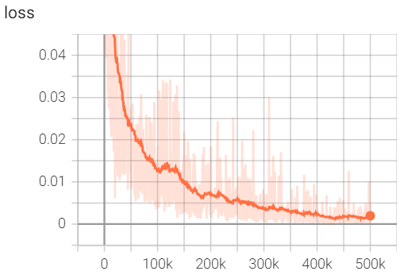

# Diffusion Policies Implementation

This is a pytorch implementation of [Diffusion Policies](https://diffusion-policy.cs.columbia.edu/) which is tested on the CarRacing-v3 environment, and trained from 20 trajectories of a human expert playing the game with a joystick.

This work was authored by Ted Staley and is Copyright © 2024 The Johns Hopkins University Applied Physics Laboratory LLC, please see the LICENSE file.

Full accompanying notes on this repo and the technique can be found here: [TODO]

### Brief Outline of Files

The key files of interest will be:

- /data_collect/ : contains expert data and a script to collect more
- /src/backbones/unet.py : the network architecture (1D Conditional UNet)
- /src/train.py : trains the diffusion policy
- /src/deploy.py : runs a saved model

### Results

The train.py script takes about 8 hours to run on a 4090 GPU and converges to near-expert level with occasional poor performance. The expert data has an average score of 923 while the trained model scores 889 on average, and 920 if the bottom 10% of runs are discarded (i.e. most runs match expert level). The training curve over 500k batches converges to an MSE of about 0.0015:

### Video of Results:

Here is a brief video of the policy running on an especially exciting track generation:

[CarRacingVideoWEBM.webm](https://github.com/user-attachments/assets/4d68c6e2-eedb-4a77-a91a-2bfb983d0cd6)

